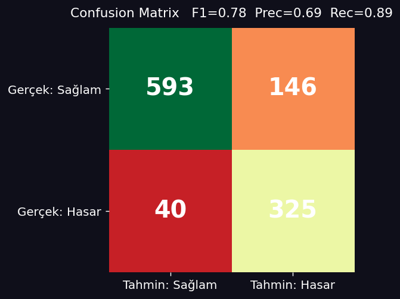
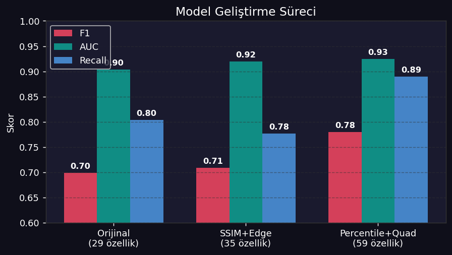
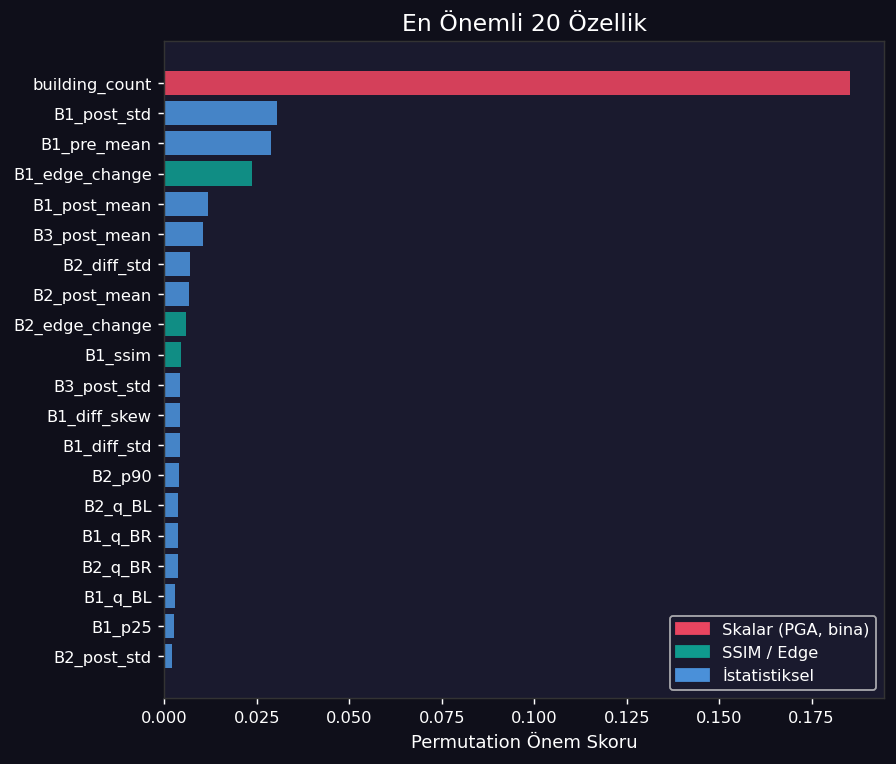
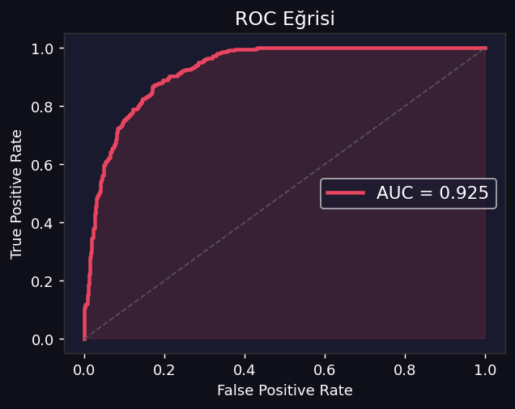
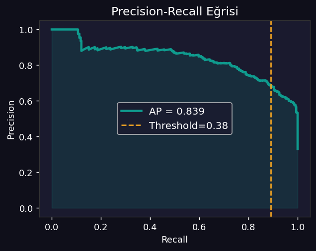
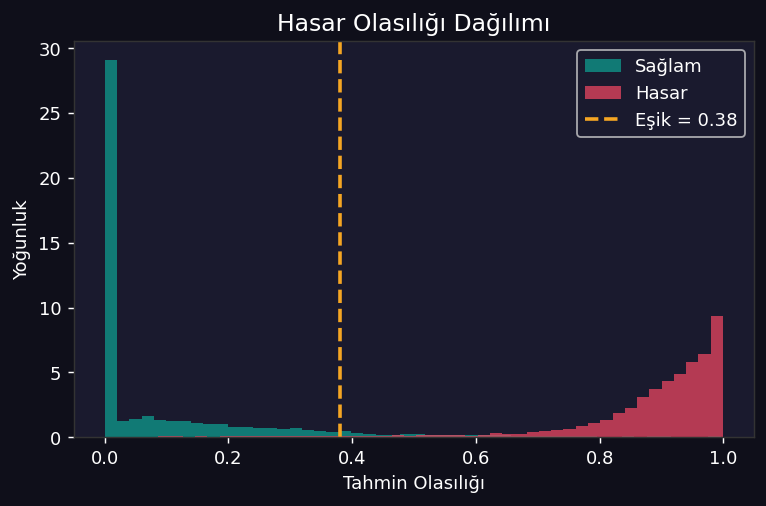
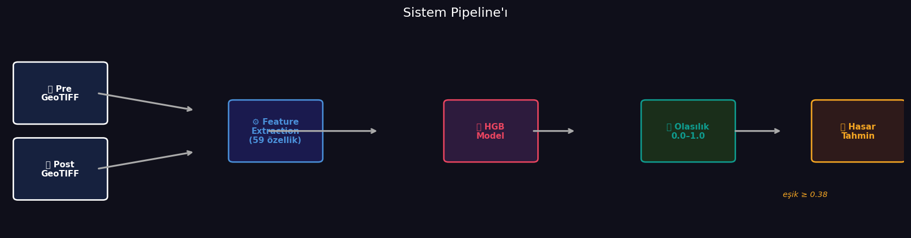
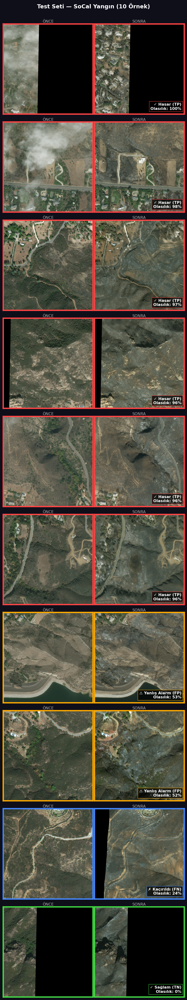

# Uydu Görüntüsü ile Deprem Hasar Tespiti

**xView2 Veri Seti · HistGradientBoostingClassifier · Binary Damage Classification**

Afet öncesi ve sonrası uydu görüntüsü çiftinden piksel düzeyinde özellikler çıkararak bina hasarını ikili (Sağlam / Hasar) sınıflandıran makine öğrenmesi projesi.

---

## Sonuçlar (En İyi Model)

| Metrik | Değer |
|--------|-------|
| F1 Score | **0.78** |
| ROC-AUC | **0.925** |
| Precision | 0.69 |
| Recall | 0.89 |
| Threshold | 0.38 |



---

## Model Geliştirme Süreci

Aynı HGB mimarisi üzerinde, yalnızca özellik seti genişletilerek iteratif iyileştirme yapıldı:

| Aşama | Özellik Sayısı | Eklenen Özellikler | Test F1 | AUC |
|-------|---------------|-------------------|---------|-----|
| v1 — Temel | 29 | mean, std, skew, kurt (per band) + 5 skalar | 0.70 | 0.90 |
| v2 — SSIM + Edge | 35 | SSIM, edge değişimi (per band) | 0.71 | 0.92 |
| **v3 — Percentile + Quad** | **59** | p10, p25, p75, p90 + 4 bölge ortalaması (per band) | **0.78** | **0.93** |



---

## Veri Seti

**xView2** — çoklu afet tipini kapsayan coğrafi etiketli uydu görüntüsü veri seti.

| Split | Görüntü Sayısı | Afet Olayları |
|-------|---------------|--------------|
| Train | 3.870 | guatemala-volcano, hurricane-florence/harvey/matthew, joplin-tornado, lower-puna-volcano, mexico-earthquake, midwest-flooding, moore-tornado, palu-tsunami, santa-rosa-wildfire, sunda-tsunami, tuscaloosa-tornado |
| Val | 3.366 | nepal-flooding, portugal-wildfire, woolsey-fire |
| Test | 3.798 | hurricane-michael, pinery-bushfire, socal-fire |
| **Toplam** | **11.034** | **19 farklı afet olayı** |

- Train: 2.163 sağlam / 1.707 hasarlı (%44 hasar)
- Test: 2.907 sağlam / 891 hasarlı (%23 hasar)

---

## 59 Özellik (Feature Set)

Her bant (R, G, B) için **18 özellik** → 3 × 18 = **54 görüntü özelliği** + **5 skalar** = **59 toplam**

**Bant başına (x3):**
| Kategori | Özellikler |
|----------|-----------|
| İstatistik | pre_mean, post_mean, diff_mean, pre_std, post_std, diff_std |
| Dağılım | diff_skew, diff_kurt |
| Yapısal | SSIM, edge_change |
| Yüzdelik | p10, p25, p75, p90 |
| Bölgesel | q_TL, q_TR, q_BL, q_BR (sol üst / sağ üst / sol alt / sağ alt) |

**Skalar (x1):**
`pga, magnitude, depth_km, acquisition_delta_days, building_count`



---

## Değerlendirme Görselleri

| | |
|--|--|
|  |  |
|  |  |

### Örnek Tahminler



---

## Proje Yapısı

```
deprem_hasar_tespiti.ipynb          ← Tüm pipeline (tek dosya)
requirements.txt

models/scalar_baseline_hgb_v3/
  model.pkl                         ← Eğitilmiş model (1.7 MB)
  inference_config.json             ← threshold, max_bands, normalize_pga

sunum_gorseller/                    ← Değerlendirme ve sunum görselleri

data/processed/
  train_split.csv                   ← GeoTIFF yolu + etiket listesi
  val_split.csv
  test_split.csv
```

> Ham görüntüler (103 GB GeoTIFF) repoda bulunmaz. [xView2 veri seti](https://xview2.org) üzerinden indirilebilir.

---

## Kurulum ve Çalıştırma

```bash
pip install rasterio scikit-learn numpy scipy pillow folium matplotlib
```

`deprem_hasar_tespiti.ipynb` dosyasını Jupyter'da aç ve sırayla çalıştır.

Notebook adımları:
1. Feature extraction fonksiyonları
2. Feature cache oluşturma (GeoTIFF'lerden, ~20 dk)
3. Veri yükleme
4. Model eğitimi / yükleme
5. Test seti değerlendirmesi
6. Değerlendirme grafikleri
7. İnteraktif hasar haritası
8. Yeni görüntü üzerinde inference

### Tek görüntü tahmini

```python
result = predict("pre_disaster.tif", "post_disaster.tif", building_count=15)
# {'probability': 0.82, 'binary_damage': 1, 'label': 'HASAR'}
```
